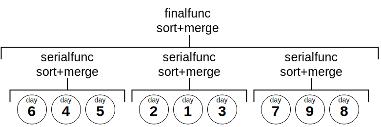

# Implementing aggregates that require ordered inputs

PostgreSQL has a couple different ways of dealing with aggregates that require ordered inputs, [ordered set aggregates](https://www.postgresql.org/docs/current/functions-aggregate.html#FUNCTIONS-ORDEREDSET-TABLE), which guarantee ordered input but have non-intuitive syntax. You can also specify an ordering within an aggregate call (ie `SELECT array_agg(foo ORDER BY foo, bar)`), however, AFAIK the aggregate doesn't know and has no way of enforcing that this ordering has occurred other than balking if it got out of order data. 

Both of these have rather annoying syntax and require the *user* to understand that the input needs to be ordered for the aggregate to function. We decided that this was a poor choice. Instead, we decided to do the ordering ourselves *inside* the aggregate function. This means that the transition function for any of the aggregates that require ordering to function (`time_weight`, `counter_agg` etc) first have a transition function that simply builds up an array of inputs to the aggregate, then sorts the array and then processes the inputs in order. 

In addition, these aggregates have different semantics for combine and rollup than some of our other functions. Once the data has been sorted and processed, in general, these aggregates can *only* be combined in the traditional sense if they contain disjoint regions of time, in other words, only aggregates covering non-overlapping periods of time can be rolled up or combined. 

PostgreSQL doesn't have a way to guarantee that only non-overlapping time periods can be sent to each parallel worker, rows are distributed essentially as they are seen in a round robin. This means that the aggregates cannot be marked as parallel safe. So then, why do they need combine functions at all? Well, there is another time when combine functions are called and that is in the case of partitionwise aggregation. Partitionwise aggregation is used to perform part of the aggregation on a particular partition and then take the state and combine with aggregates from other partitions. Partitions are disjoint in time for us (this assumes some things and we should still have checks to make sure that we are not getting out of order / overlapping data). We believe the test for this is whether they have a combine function, not whether they are marked parallel safe. Therefore, we always mark these aggregates as parallel restricted rather than parallel safe, which hopefully will allow them to be used for partitionwise but not parallel aggregates. Partitionwise aggregation is a potential large optimization area for multinode so we wanted to make sure we could support that case. 

This also impacts the way that `rollup` can be called on these functions and the cases in which we should error. 

Note also that the `combine` and `rollup` functions for these aggregates must do essentially the same thing that the transition function does and build up an array of partial states, then order them and combine them at the end. This is a bit odd, but seems to be the best way. 

## Implementation example

Here is the rollup aggregate for `TimeWeightSummary`:
```SQL , ignore
CREATE AGGREGATE rollup(tws TimeWeightSummary)
(
    sfunc = time_weight_summary_trans,
    stype = internal,
    finalfunc = time_weight_final,
    combinefunc = time_weight_combine,
    serialfunc = time_weight_trans_serialize,
    deserialfunc = time_weight_trans_deserialize,
    parallel = restricted
);
```

### Parallel safety
The aggregate above is marked as `parallel = restricted`, which specifies that ["the function can be executed in parallel mode, but the execution is restricted to parallel group leader"](https://www.postgresql.org/docs/current/sql-createfunction.html). Note that only the value of the `parallel` parameter of the `CREATE AGGREGATE` call is used for determining the parallel safety of the aggregate; the parallel safetyness of the support functions that make up the aggregate are ignored when the aggregate is called. But all support functions should be marked parallel safe because, AFAIK, they are immutable and parallel safe in all cases, it is only when they are called in the correct ordering with the aggregate that they can cause problems / error if not used correctly. 

### Merging on serialization

In many cases the implementation of aggregate merging requires that the aggregates to be merged cover non-overlapping periods of time. To handle this while allowing the inputs to be potentially unordered, in the aggregate:
- the transition function appends the input to a `Vec`
- the final function sorts the transition state and merges all of the elements

Storing all of the inputs ever seen in the transition state takes up a lot of memory, and makes the final function use a lot of compute. We can partially alleviate those issues by:

- Adding a `combinefunc` that appends the second transition state `Vec` to the first one
- Adding a `serialfunc` that:
  1. Sorts and merges the transition state
  2. Serializes the transition state
 - Adding a `deserialfunc` that deserializes the transition state

These extra functions improve performance when the inputs are partitioned since each partition is combined, and then the partition combinations are combined again.

`serialfunc` is called right before sending the current transition state from the parallel worker to the parent process, so it's the only place where we can do the sorting/merging of the transition state before it gets sent to the parent process. We do the merging in the parallel worker to reduce the amount of data sent from the parallel worker to the parent process.



This method doesn't work when two partitions contain overlapping time ranges. That shouldn't happen when the partitions are chunks of a TimescaleDB hypertable, but it could happen when the partitions cover overlapping segments of time (e.g. a table that uses declarative partitioning to partition a table using the hash of an ID). When two partitions contain overlapping time ranges, the implementation should catch that and give an error.

Note that this approach means that `deserialfunc(serialfunc(x)) != x`, which is weird but doesn't seem to cause any problems.


